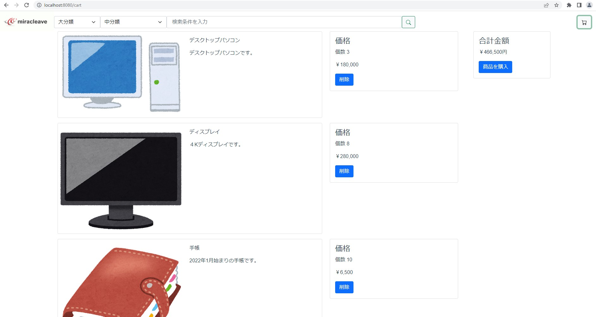
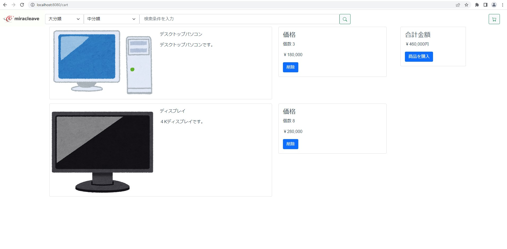

# コード修正(カート)

## 確認対象のソース

- src/views/Cart.vue


## 既存コードを確認しよう。

カート画面上に商品詳細画面でカートに追加した商品が表示されています。画面右側に商品の合計値が表示されていますね。  
  
カートに入っている商品を削除ボタンで削除してみると、合計額が変更されるのを確認できると思います。  
  
カート画面のソースを確認すると、 mounted の際にも、handleDelete にも合計値取得処理（this.getTotal())が記載されています。

```javascript
    mounted: function () {
        // DOMのマウント終了後の処理
        /** 合計値取得処理 */
        this.totalPrice = this.getTotal()
    },

    methods: {
        /**
         * 削除ボタン押下
         */
        handleDelete (index) {
          // storeから該当商品を削除
          this.$store.commit('deleteItem', index)
          /** 合計値取得処理 */
          this.totalPrice = this.getTotal()
        },

        /**
         *合計値取得
         */
        getTotal () {
          let price = 0
          this.getItemList.forEach(element => {
            price += element.price * element.quantity
          })
          return price
        }
    },
```

今まで登場した Vue.js の機能を使えば、削除ボタンのクリックイベント発火時に毎回合計値取得処理を明示的に呼び出す必要がなくなります。  
ここで今日のハンズオン参加者の皆様にクイズです。ここで利用するべき Vue.js の機能とは一体何でしょうか？

1. **created**
2. **mounted**
3. **computed**  
   皆さん、考えてみましょう！
