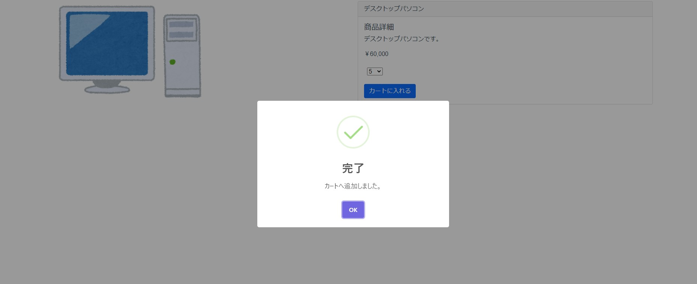

# コード修正(商品情報詳細)

## 修正対象のソース
* src/store/index.js
* src/views/detailView.vue

続いては商品詳細画面です。

この画面は、検索画面で選択した商品の詳細情報が掲載されています。またこの画面でポイントとなるのは、**商品をカートに入れる機能**です。


## 商品をカートに追加するための機能を実装しよう。
* **src/store/index.js**&emsp;←&emsp;修正するファイル  

修正する前に一度、状況を確認してみましょう。  
http://localhost:8080/detail?itemCode=2  
商品の個数を選択して、カートに入れるボタンを押下してみてください。  
「カートに追加しました。」というダイアログが出て、OKボタンを押下すると検索画面へ戻ります。  

では、この状態でカート画面へ遷移してみましょう。  
http://localhost:8080/cart  
先ほどカートに商品を追加したはずですが、カート画面を開いてみても、何も表示されません。
  
確認できたところで、改めて修正を進めていきましょう。  
<br/>
今回はVuexというライブラリを使用して、商品をカートに入れます。
"Vuex"とはVue.js アプリケーションのための 状態管理パターン + ライブラリです。

https://vuex.vuejs.org/ja/ (Vue.js公式サイトより)

 
では、実際に修正していきましょう。今回修正する箇所は"src/store/index.js"の"mutations"の箇所です。  
mutationsにカートに入れるボタンを押下した際に、商品情報を保持するための処理を追加します。 

変更前
```javascript
  mutations: {
    // 商品削除
    deleteItem (state, item) {
      // 引数で渡された行を削除
      state.itemList.splice(item, 1)
    },
    // 商品リスト初期化
    clearItem (state) {
      state.itemList = []
    }
  }
```

変更後

18行目のmutationsの下に商品追加のソースを追加してください。
```javascript
  mutations: {
    // 商品追加
    pushItem (state, item) {
      // 引数で渡された配列をまるごとpush
      state.itemList.push(item)
    },
    // 商品削除
    deleteItem (state, item) {
      // 引数で渡された行を削除
      state.itemList.splice(item, 1)
    },
    // 商品リスト初期化
    clearItem (state) {
      state.itemList = []
    }
  },
```

pushItemはカートボタンをクリック時に使用し、これで商品情報を保持させることができます。  
この処理は、この後detailView.vueの修正でも使用します。  
他にも商品削除のdeleteItemなどありますが、こちらは次の章のカート画面上で使用します。  
商品をカートの保持情報から削除するための処理になります。


## カートに入れる機能を追加しよう。
* **src/views/detailView.vue**&emsp;←&emsp;今回修正するファイル

ここでは、商品検索で選択した商品情報をカートに入れる処理を追加します。
methodsの中にある「additem」の処理を下記のように修正してみましょう。

変更前
```javascript
addItem () {
  // storeに保存後ダイアログ表示して検索画面へ戻る
  this.$swal({
    title: '完了',
    icon: 'success',
    text: 'カートへ追加しました。',
    type: 'success',
    confirmButtonText: 'OK'
  }).then((info) => {
    this.$router.push({ path: '/' })
  })
}
```
変更後

104行目の addItemの下に商品情報を保持するためのソースを追加してください。
```javascript
addItem () {
  // storeに保存後ダイアログ表示して検索画面に戻る
  const param = {
    name: this.productName,
    description: this.description,
    price: this.price,
    quantity: Number(this.quantity),
    imageUrl: this.img // 商品画像
  }
  this.$store.commit('pushItem', param)
  // storeに保存後ダイアログ表示して検索画面へ戻る
  this.$swal({
    title: '完了',
    icon: 'success',
    text: 'カートへ追加しました。',
    type: 'success',
    confirmButtonText: 'OK'
  }).then((info) => {
    this.$router.push({ path: '/' })
  })
}
```
まず画面に表示されている商品のパラメーターをオブジェクトparamに設定します。それぞれ商品名・商品説明・値段・数量・商品画像です。

次に先ほど追加した「pushItem」を呼び出して商品情報をstoreに追加します。  
書き方としては、this.$store.commit('呼び出す処理名',処理に渡す引数)でstoreのstateの値を変更します。  
第一引数をstore/index.jsのmutationsに追加したpushItemにします。  
第二引数は商品情報をもった変数paramにすることで、  
store/index.jsのstateのitemListに商品情報を追加します。

カート画面ではstoreの保持しているitemListを、gettersを使用することでカート画面上に表示させています。

## 動作確認
動作確認をしてみましょう。
プルダウンで任意の商品数を選択肢し、商品を購入のボタンをクリックしてください。

下記のように完了のダイアログが表示され検索画面に遷移します。  
  
商品がカートに入っているか確認してみましょう。  
画面右上のショッピングカートのアイコンをクリックすることで、カート画面へ遷移します。  
カートに入れた商品が表示されることがわかるかと思います。  
  

商品を削除するのにもVuexが使用されております。
mutationsに既にあったdeleteItemとclearItemです。deleteItemはカートに入った商品を削除する時に、clearItemは商品を注文した時に使用します。
